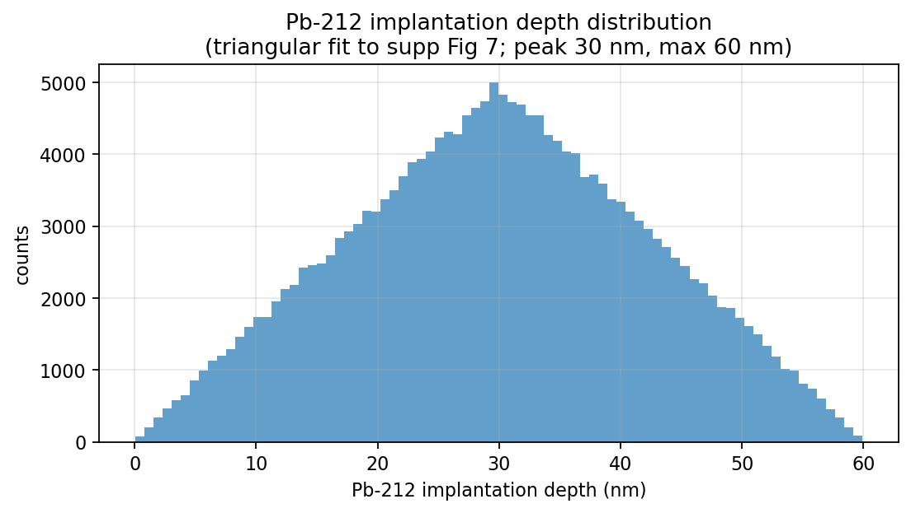
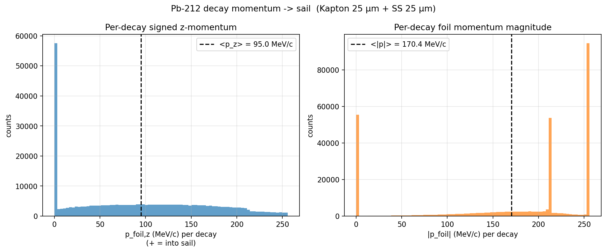
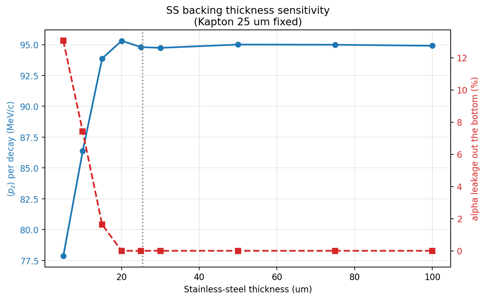
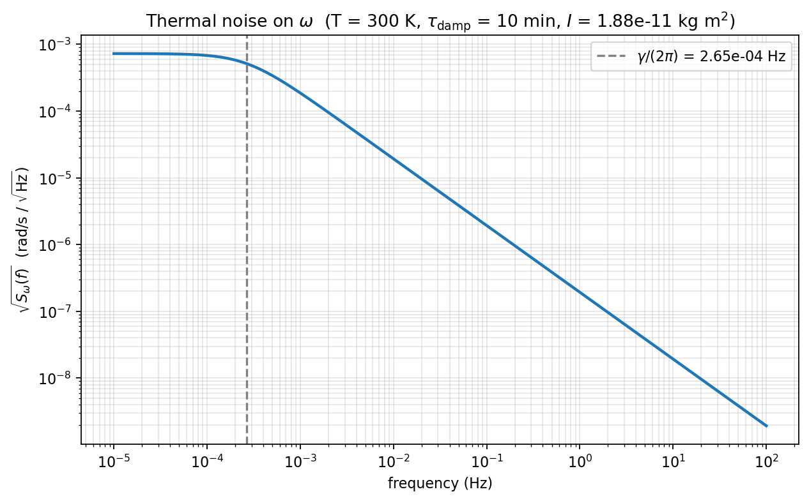
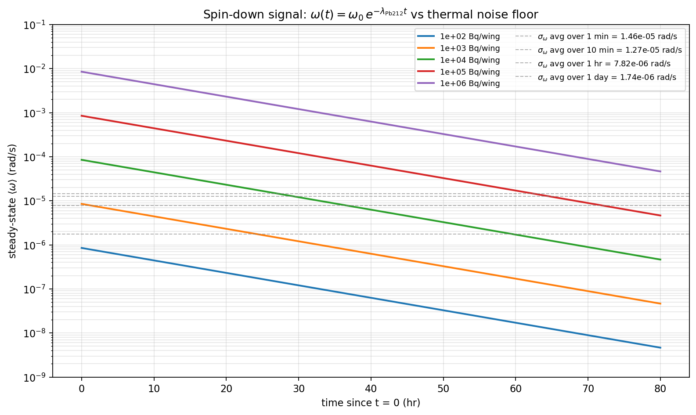
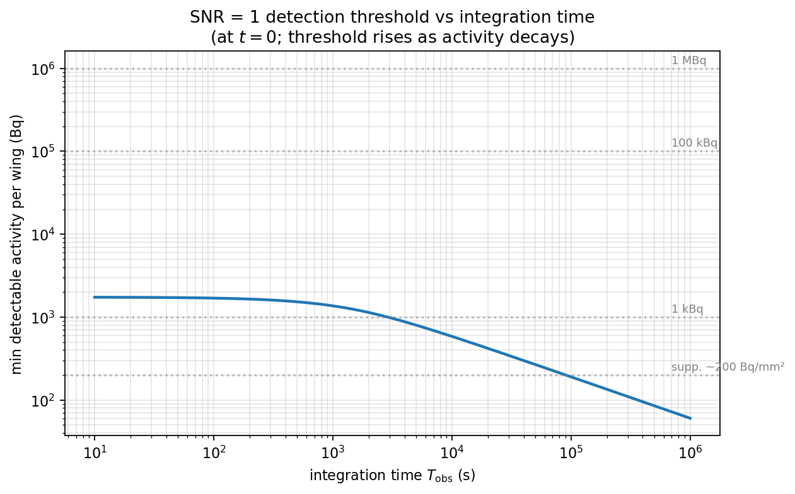

# Sail momentum from ²¹²Pb decay chain

Monte Carlo estimate of the momentum transferred per ²¹²Pb decay to a
laminated sail (Kapton tape + stainless-steel backing) with the ²¹²Pb
implanted in the top of the Kapton.

## Geometry

```
  z = 0          top surface  (vacuum, where Po-216⁺ landed)
  z ∈ [0, t_K]   Kapton tape, 1 mil (25.4 µm).   Pb-212 implanted
                 in the first ~60 nm from the top.
  z ∈ [t_K, t_K + t_SS]   Stainless steel, 1 mil (25.4 µm).
  z > t_K + t_SS          Vacuum below.
```

The Pb-212 sits a few tens of nm deep in the Kapton; the SS is below
it, thick enough to stop the chain alphas; the laser-cut sail has this
stack as its body. With activity only on one face, the resulting
recoil pushes the sail in the −z direction (away from the activity
side, into the disk slot).

## Decay chain (per ²¹²Pb decay)

Both β steps (²¹²Pb→²¹²Bi and ²⁰⁸Tl→²⁰⁸Pb) have negligible recoil and
are ignored. Each Pb-212 decay yields exactly one α + heavy daughter:

| Branch | Prob | Eα (MeV) | Daughter | E_recoil (keV) | p_α (MeV/c) |
|---|---|---|---|---|---|
| ²¹²Po α | 64.06 % | 8.78 | ²⁰⁸Pb | 169 | 255.8 |
| ²¹²Bi α | 35.94 % | 6.05 | ²⁰⁸Tl | 116 | 212.4 |

## Implantation depth

The Pb-212 implantation depth distribution is taken from Fig. 7 of
the supplementary material (the "nearest distance from sphere
surface" black curve). It peaks at ~30 nm and is essentially zero
beyond 60 nm. The simulation uses a triangular fit with peak 30 nm,
support [0, 60] nm:



## Physics

For each decay, momentum conservation gives

> **p_foil = − (p_α_exit + p_daughter_exit)**

with `p_*_exit = 0` if that particle is stopped in the foil stack.
The daughter direction is opposite the α direction.

There are four geometric cases:

| α direction | α fate (vs foil) | Daughter fate | p_foil |
|---|---|---|---|
| **UP** | escapes out top (Kapton only ~30 nm above it) | range << Kapton → stops | **−p_α** |
| DOWN | stops in SS (range 22 µm < 25 µm at 8.78 MeV; less for 6 MeV) | goes UP; escapes only if d / \|cos θ\| < R_daughter | **0** or **partial daughter momentum** depending on escape |
| DOWN, very oblique | even more SS path → stops | same as above | same |
| DOWN, alpha leaks through SS | rare for ≥20 µm SS (see sweep) | — | reduced |

Range models (power law `R = a·Eⁿ`, n ≈ 1.7) calibrated to NIST ASTAR
values: 73 µm at 8.78 MeV in Kapton, 22 µm in SS. Heavy-daughter
ranges from rough SRIM-like values: ~90 nm (Pb-208) and ~70 nm
(Tl-208) in Kapton. These can be replaced with measured/SRIM
values in `DAUGHTER_R` and `ALPHA_RANGE_COEFF` if more precision is
needed.

The daughter range relative to implantation depth (~90 nm vs ~30 nm)
sets how often the daughter escapes when the α goes down. For
`d / R_d ≈ 1/3`, ~⅔ of "α down" events have an escaping daughter.

## Closed-form sanity check

For depth d, daughter range R_d, isotropic α emission with
u ≡ cos θ_α ~ U(−1, 1):

```
⟨p_foil,z⟩ = ½ ∫₋₁⁰ (−p_α u) du
           + ½ ∫_{d/R_d}^1 p_α · u · √(1 − d/(R_d·u)) du
```

For d = 30 nm:
- Po-212 (R_d = 90 nm): ⟨p_z⟩ ≈ 0.401 p_α(8.78) ≈ 103 MeV/c
- Bi-212 (R_d = 70 nm): ⟨p_z⟩ ≈ 0.375 p_α(6.05) ≈ 80 MeV/c

Branching-weighted: **~94 MeV/c per Pb-212 decay**, or 78 % of the
theoretical maximum p_α/2 (if every daughter were caught).

## Monte Carlo result

300 k decays, 25 µm Kapton + 25 µm SS:

```
<p_z>  = +94.97 MeV/c  per decay
std    =  74.01 MeV/c
F      =  5.08 × 10⁻²⁰ N per Bq of ²¹²Pb on the sail face
```

Matches the closed-form estimate to within MC statistics (~0.5%).



The signed-z histogram (left) shows the broad continuum of "alpha goes
up, daughter caught" contributions. The magnitude histogram (right)
exposes the structure cleanly:
- Spike at **0**: both particles caught inside the foil → momenta
  cancel.
- Spike at **~212 MeV/c**: ²¹²Bi α at near-normal incidence going up,
  daughter caught, no losses → foil sees full α momentum.
- Spike at **~256 MeV/c**: same for ²¹²Po α (8.78 MeV).

## SS-thickness sensitivity

The SS backing has to be thick enough to stop downward-going alphas;
once it is, `⟨p_z⟩` saturates and stops depending on the exact
thickness. Sweep over `t_SS` confirms 1 mil is comfortably past the
threshold:



- t_SS < 15 µm: alphas leak out the bottom, dragging `⟨p_z⟩` down
  (each leaked α takes its momentum with it in the +z direction,
  partially canceling the foil's net −z momentum from daughters).
- t_SS ≥ 20 µm: no leakage, ⟨p_z⟩ flat at ~95 MeV/c.
- **t_SS = 1 mil (25.4 µm) is solidly in the safe regime.**

## Implications for the spinning sail

Two-wing pinwheel sail (activity A on each wing's face, opposite
faces so torques add). With current `slotted_disk_3p5.dxf` geometry:

| Activity per wing | Force / wing | Torque | α | ω after 1 day |
|---|---|---|---|---|
| 1 kBq | 5 × 10⁻¹⁷ N | 1.3 × 10⁻¹⁹ N·m | 7 × 10⁻⁹ rad/s² | 0.6 mrad/s |
| 100 kBq | 5 × 10⁻¹⁵ N | 1.3 × 10⁻¹⁷ N·m | 7 × 10⁻⁷ rad/s² | 60 mrad/s |
| **1 MBq** | **5 × 10⁻¹⁴ N** | **1.3 × 10⁻¹⁶ N·m** | **7 × 10⁻⁶ rad/s²** | **0.6 rad/s ≈ 0.1 Hz** |

I_total (disk + sail) used: 1.88 × 10⁻¹¹ kg·m²; r_c = 2.625 mm; F = ⟨p_z⟩·A.

## Knobs (constants at top of `sail_momentum_mc.py`)

- `T_KAPTON_DEFAULT` — Kapton thickness (default 25.4 µm)
- `T_SS_DEFAULT` — SS thickness (default 25.4 µm)
- `ALPHA_RANGE_COEFF`, `ALPHA_RANGE_EXP` — alpha range fit per material
- `DAUGHTER_R` — heavy-daughter ranges per material
- `sample_depths()` — implantation depth distribution; replace with
  measured CDF if available

## Limitations

1. Heavy-daughter ranges are rough (single value per energy). SRIM
   would give better numbers but the sensitivity to ±20 % is small
   (~few % in ⟨p_z⟩) since the daughter is mostly caught either way.
2. No lateral scattering — for the bulk-stopping cases this is
   negligible (multiple scattering deflects by a few degrees at most
   for our energies/materials), but it means our "alpha leakage"
   number for thin SS is slightly optimistic.
3. Kapton ≠ polystyrene — alpha range fit is approximate. Calibrate
   against SRIM for Kapton specifically if precision matters.
4. The β recoils (²¹²Pb→²¹²Bi, ²⁰⁸Tl→²⁰⁸Pb, ²¹²Bi→²¹²Po) are ignored;
   they carry < 1 MeV/c each and don't shift the result.

---

# Spin-down measurement: thermal-noise floor & signal model

`thermal_noise_spindown.py` computes the thermal-noise limit on ω for
a rotor in equilibrium at T = 300 K with damping rate γ = 1/(10 min),
and compares it against the expected ω(t) curve as Pb-212 activity
decays away with its 10.6 hr half-life.

## Setup

We use the moment of inertia of the disk+sail assembly (`I_total =
1.88 × 10⁻¹¹ kg·m²` from the MoI calc) and the per-decay momentum
above (`5.08 × 10⁻²⁰ N/Bq` per wing face). Two-wing pinwheel sail
with both wings carrying activity → torque doubles:

> α(t) = 2 F r_c / I_total = (1.42 × 10⁻¹¹ rad/s² per Bq/wing) · A(t)

Since **γ ≫ λ_Pb212 (10 min vs 10.6 hr → ratio ≈ 92×)**, the rotor
tracks the source adiabatically:

> **ω_ss(t) ≈ α(t) / γ = (8.5 × 10⁻⁹ rad/s per Bq/wing) · A(0) · e^(−λ_Pb212 t)**

So the "spin-down measurement" amounts to logging ω(t) and watching
its exponential decay with the Pb-212 half-life.

## Thermal noise

The PSD of ω from the fluctuation-dissipation theorem (one-sided):

$$S_\omega(f) = \frac{4 k_B T\, \gamma}{I\,(\gamma^2 + (2\pi f)^2)}$$



The corner frequency is γ/(2π) ≈ 0.27 mHz. Below that the noise PSD
is flat at `S_ω(0) = 4k_B T / (I γ) ≈ 5.3 × 10⁻⁷ rad²/s²/Hz`; above,
it falls as 1/f².

Equipartition gives the instantaneous RMS:

> σ_ω (instantaneous) = √(k_B T / I) = **1.48 × 10⁻⁵ rad/s**

Averaging ω over a window T_obs reduces the RMS (Ornstein-Uhlenbeck
result, exact for any γT_obs):

$$\sigma^2_{\langle\omega\rangle_T} = \frac{2\,\sigma_\text{inst}^2}{(\gamma T)^2}\bigl(\gamma T - 1 + e^{-\gamma T}\bigr)$$

For T_obs ≫ 1/γ this is `σ_inst · √(2 / γT_obs)`. Numerical values:

| T_obs | σ_ω (rad/s) | Min detectable A (Bq/wing, SNR=1) |
|---|---|---|
| 1 min  | 1.46 × 10⁻⁵ | 1700 |
| 10 min | 1.27 × 10⁻⁵ | 1500 |
| 1 hr   | 7.83 × 10⁻⁶ | 920 |
| 1 day  | 1.74 × 10⁻⁶ | 200 |
| 5 days | 7.82 × 10⁻⁷ | 90 |

## Signal vs. noise

ω(t) for a few initial activities (per wing), with averaged noise
floors overlaid:



The slope of each line equals -λ_Pb212 ≈ -1.81 × 10⁻⁵ /s
(half-life 10.6 hr) — independent of activity, only the offset shifts.
**A measured ω(t) curve with the right slope is the smoking gun**
for the alpha-decay-driven torque.

For the supplementary's ~200 Bq/mm² implantation level, ω_ss(0) ≈
1.7 × 10⁻⁶ rad/s, which is at the day-long-average noise floor.
That's borderline detectable but workable: a few-day integration with
exponential-decay fitting beats a single-point SNR check by a large
factor since the model has only ~2 free parameters (initial activity
and time origin) against many independent ω measurements.

## Detection threshold



The dashed reference lines show typical activities you might
realistically achieve. At ~1 day of integration the supplementary's
~200 Bq/mm² implantation crosses the SNR = 1 line; longer integration
buys you another factor of ~10 in sensitivity before the activity
itself has decayed away significantly.

## Knobs in `thermal_noise_spindown.py`

- `GAMMA` — rotational damping rate. Lower γ (better vacuum or
  better-balanced rotor) gives lower thermal noise and proportionally
  larger ω_ss for the same torque. Threshold A scales as γ³ᐟ² (signal
  → A/γ; noise → √(1/γ) at fixed T_obs).
- `T_KELVIN` — bath temp; σ_ω goes as √T.
- `I_TOTAL` — assembly moment of inertia. Larger I lowers σ_ω as
  1/√I but lowers signal as 1/I → threshold A goes as I^½.
- `PZ_PER_DECAY`, `R_C` — from the per-decay momentum calc above.

This is a **necessary** check (thermal noise must be below the
signal), but **not sufficient** — additional noise sources to worry
about: 1/f from trap-position drift, vibration coupling into rotation,
gas pressure changes shifting γ during the measurement, etc.
